# Visual Glossary

## Obstacle/Ledge_OneWayDown
- **Notes:** Brown rocky ledge. Can jump down (South) but cannot walk up (North) through it.

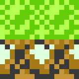

## Obstacle/White_Fence
- **Notes:** White stone fence acting as an obstacle. Separates vertical paths.

## Obstacle/Dense_Bush
- **Notes:** Dark green dense leaf tile. Acts as a solid wall. Cannot be walked through.

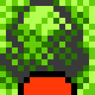

## Walkable/Tall_Grass
- **Notes:** Light green tile with darker green 'V' shapes. Moving through these tiles can trigger wild Pokémon encounters.

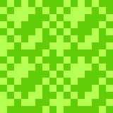

## Obstacle/Hedge_Fence
- **Notes:** Green hedge with a white cross pattern. Acts as a solid wall blocking movement.

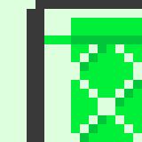

## Obstacle/Tree_Trunk
- **Notes:** Large brown tree trunk tile found in Viridian Forest. Acts as a solid wall.

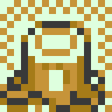

## Obstacle/Tree_Top
- **Notes:** The top half of a tree. Acts as a solid wall. Sometimes used without a trunk to represent a dense bush.

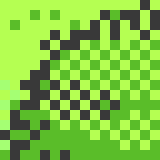

## Object/Gym_Statue
- **Notes:** Statue found at the entrance of Gyms. Can be read to see who has defeated the Gym Leader.

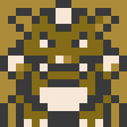

## Obstacle/Gym_Rock_Wall
- **Notes:** Brown rocky wall tile used in Pewter Gym. Acts as a solid boundary.

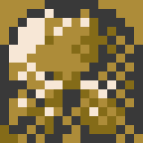

## Obstacle/Mountain_Wall
- **Notes:** Vertical brown/white speckled rock wall. Acts as a solid obstacle blocking Eastward movement on Route 3.

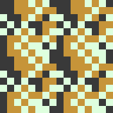

## Walkable/Paved_Path
- **Notes:** White stone tile with dashed lines. Forms the paved path leading to Mt. Moon.

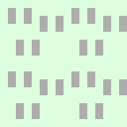

## Obstacle/Sign_Left
- **Notes:** The left half of a wide wooden signpost. Likely solid.

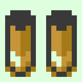

## Obstacle/Cliff_Edge_South
- **Notes:** Solid rock obstacle forming the southern boundary of the route. Cannot be jumped over.

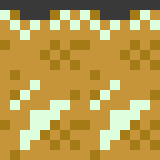

## Obstacle/Ledge_Inner_Corner
- **Notes:** Diagonal tile. Top right is walkable (paved path), bottom left is brown rock. Blocks movement.

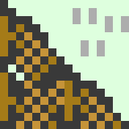

## Readable/Sign_Right_Half
- **Notes:** White board with black text lines. This is the right half of a signpost. Not a cave entrance.

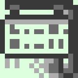

## Walkable/Ledge_Ramp
- **Notes:** Light brown path with a white dashed line. Acts as a ramp allowing movement UP (North) through a one-way ledge.

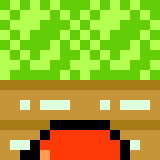

## Walkable/Pink_Flower
- **Notes:** Pink flower tile found on the Northern Lane. Walkable.

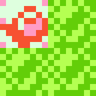

## Warp/Cave_Entrance
- **Notes:** Black archway in a brown rock wall. Acts as a warp to the cave interior.

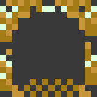

## Walkable/Cave_Floor_Lower
- **Notes:** Dark purple/blue rocky blocks. This is the main walkable lower floor of Mt. Moon. Verified Turn 2246.

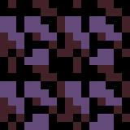

## Walkable/Cave_Floor_Raised
- **Notes:** Dark brown floor with light brown specks. This is the walkable elevated platform area. Verified Turn 2246.

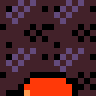

## Obstacle/Cave_Wall_Blue
- **Notes:** Light blue rocky wall tile. Acts as a solid obstacle in Mt. Moon.

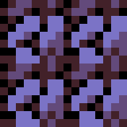

## Warp/Ladder_Down
- **Notes:** A ladder with grey rails and blue/black rungs. Acts as a warp to the next floor down in a cave.

## Walkable/Stairs_Up
- **Notes:** Walkable horizontal lines acting as stairs to an elevated platform. Verified Turn 2207.

## Obstacle/Chasm_Blue
- **Notes:** Blue patterned chasm. Blocks movement. Verified Turn 2245.

## Object/Item_Ball
- **Notes:** Orange sphere with black outline. Typically contains an item.

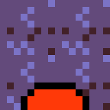

## Object/Fossil_Shell
- **Notes:** Bluish-grey shell-like object on a raised platform in Mt. Moon B2F.

## Obstacle/Cliff_East_Facing
- **Notes:** Blue and light blue checkered tile found on B2F. Verified as the solid cliff face separating the raised platform (West) from the lower floor (East). Impassable.

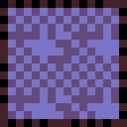

