# Visual Glossary

## Obstacle/Ledge_OneWayDown
- **Notes:** Brown rocky ledge. Can jump down (South) but cannot walk up (North) through it.

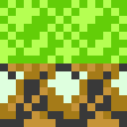

## Obstacle/White_Fence
- **Notes:** White stone fence acting as an obstacle. Separates vertical paths.

## Obstacle/Dense_Bush
- **Notes:** Dark green dense leaf tile. Acts as a solid wall. Cannot be walked through.

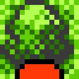

## Walkable/Tall_Grass
- **Notes:** Light green tile with darker green 'V' shapes. Moving through these tiles can trigger wild Pokémon encounters.

## Obstacle/Hedge_Fence
- **Notes:** Green hedge with a white cross pattern. Acts as a solid wall blocking movement.

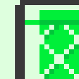

## Obstacle/Tree_Trunk
- **Notes:** Large brown tree trunk tile found in Viridian Forest. Acts as a solid wall.

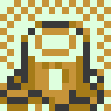

## Obstacle/Tree_Top
- **Notes:** The top half of a tree. Acts as a solid wall. Sometimes used without a trunk to represent a dense bush.

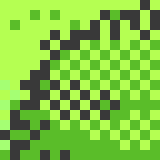

## Object/Gym_Statue
- **Notes:** Statue found at the entrance of Gyms. Can be read to see who has defeated the Gym Leader.

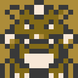

## Obstacle/Gym_Rock_Wall
- **Notes:** Brown rocky wall tile used in Pewter Gym. Acts as a solid boundary.

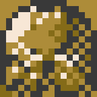

## Obstacle/Mountain_Wall
- **Notes:** Vertical brown/white speckled rock wall. Acts as a solid obstacle blocking Eastward movement on Route 3.

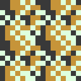

## Walkable/Paved_Path
- **Notes:** White stone tile with dashed lines. Forms the paved path leading to Mt. Moon.

## Obstacle/Sign_Left
- **Notes:** The left half of a wide wooden signpost. Likely solid.

## Obstacle/Cliff_Edge_South
- **Notes:** Solid rock obstacle forming the southern boundary of the route. Cannot be jumped over.

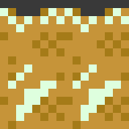

## Obstacle/Ledge_Inner_Corner
- **Notes:** Diagonal tile. Top right is walkable (paved path), bottom left is brown rock. Blocks movement.

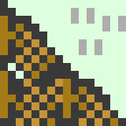

## Readable/Sign_Right_Half
- **Notes:** White board with black text lines. This is the right half of a signpost. Not a cave entrance.

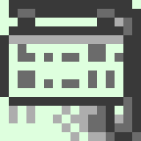

## Walkable/Ledge_Ramp
- **Notes:** Light brown path with a white dashed line. Acts as a ramp allowing movement UP (North) through a one-way ledge.

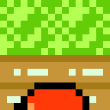

## Walkable/Pink_Flower
- **Notes:** Pink flower tile found on the Northern Lane. Walkable.

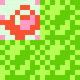

## Warp/Cave_Entrance
- **Notes:** Black archway in a brown rock wall. Acts as a warp to the cave interior.

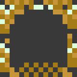

## Walkable/Cave_Floor_Lower
- **Notes:** Dark purple/blue rocky blocks. This is the main walkable lower floor of Mt. Moon. Verified Turn 2246.

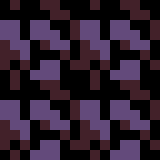

## Walkable/Cave_Floor_Raised
- **Notes:** Dark brown floor with light brown specks. This is the walkable elevated platform area. Verified Turn 2246.

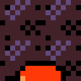

## Obstacle/Cave_Wall_Blue
- **Notes:** Light blue rocky wall tile. Acts as a solid obstacle in Mt. Moon.

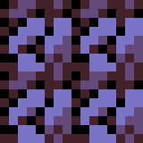

## Warp/Ladder_Down
- **Notes:** A ladder with grey rails and blue/black rungs. Acts as a warp to the next floor down in a cave.

## Walkable/Stairs_Up
- **Notes:** Walkable horizontal lines acting as stairs to an elevated platform. Verified Turn 2207.

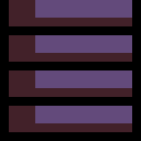

## Obstacle/Chasm_Blue
- **Notes:** Blue patterned chasm. Blocks movement. Verified Turn 2245.

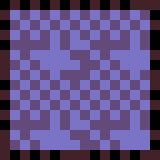

## Object/Item_Ball
- **Notes:** Orange sphere with black outline. Typically contains an item.

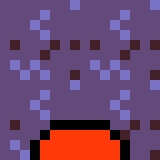

## Object/Fossil_Shell
- **Notes:** Bluish-grey shell-like object on a raised platform in Mt. Moon B2F.

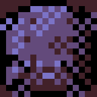

## Obstacle/Cliff_East_Facing
- **Notes:** Blue and light blue checkered tile found on B2F. Verified as the solid cliff face separating the raised platform (West) from the lower floor (East). Impassable.

## Obstacle/Cave_Wall_DarkBrown
- **Notes:** Dark red/brown blocky wall. Acts as a solid boundary on the southern edge of B2F Lower Floor.

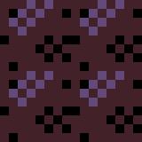

## Obstacle/Brown_Pillars
- **Notes:** Two vertical brown pillars or tree trunks. Appears to be a solid obstacle blocking Eastward movement.

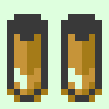

## Walkable/Floor_PokeBall_Pattern
- **Notes:** A floor tile with a Poké Ball design. It is completely walkable and is not an item. Found in S.S. Anne cabins.

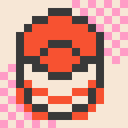

## Obstacle/Tree_Cuttable
- **Notes:** A thin tree that can be removed using the HM move CUT.

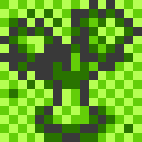

## Obstacle/House_Roof_Edge
- **Notes:** Light green tile with grey marks, appears to be the top edge of a house roof.

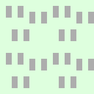

## Obstacle/Sign_Back
- **Notes:** White rectangular object with black markings. Looks like the back of a sign or map board. Solid obstacle.

## Obstacle/Hedge_Block
- **Notes:** Solid green block with a leaf pattern. Appears to be a hedge blocking movement.

## Obstacle/Blue_Lattice_Fence
- **Notes:** Blue patterned fence/wall tile. Acts as a solid boundary behind the Poké Mart.

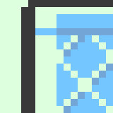

## Obstacle/Building_Roof_Right_Edge
- **Notes:** The right edge of a blue building roof. Not stairs. Solid obstacle.

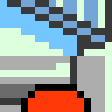

## Obstacle/Yellow_Lattice_Fence
- **Notes:** Yellow fence with a white diamond pattern. Looks like a solid boundary.

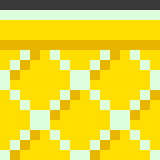

## Obstacle/Red_Lattice_Fence
- **Notes:** Red/orange brick or lattice fence tile. Likely a solid boundary.

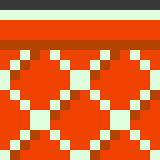

## Obstacle/Water_Edge_East
- **Notes:** Water tile bordering land on the East side. Blocks movement.

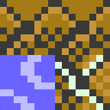

## Walkable/Wooden_Dock
- **Notes:** Brown tile with white dashed lines. Appears to be a wooden pier or dock.

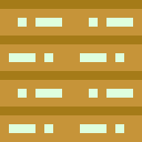

## Walkable/Stairs_Down_Yellow
- **Notes:** Yellow horizontal lines on a brown background. Appears to be stairs leading down further into the S.S. Anne.

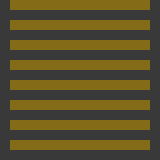

## Obstacle/Window_Porthole
- **Notes:** White wall tile with a blue circular window. Solid obstacle found on the North walls of the S.S. Anne.

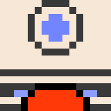

## Warp/Stairs_Up_Left
- **Notes:** Grey/white stairs going up and to the left. Likely leads to 3F or the deck.

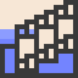

## Warp/Stairs_Yellow_Diagonal
- **Notes:** Yellow and brown diagonal stairs. Likely leads to another floor on the S.S. Anne.

## Warp/Door_Red
- **Notes:** A red door on the north wall of the S.S. Anne 2F. Likely a warp to a cabin or special room.

## Object/Gym_Trash_Can
- **Notes:** Circular grey object found in Vermilion Gym. Likely contains switches to unlock the door to the Gym Leader.

## Warp/Stairs_Down_Gatehouse
- **Notes:** Stairs leading down inside a gatehouse building, like the Underground Path entrance.

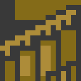

## Walkable/Underground_Path_Floor
- **Notes:** Pink tile with a red X pattern. Walkable floor of the Underground Path.

## Obstacle/Unknown_Striped_Barrier
- **Notes:** Found at Viridian Forest north exit near (2, 1). Horizontal white/brown stripes. Blocked moving Up from (2, 2).

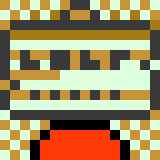

## Obstacle/Ledge_OneWayEast
- **Notes:** Vertical ledge. The grey path (high ground) is on the left, brown rock (low ground) is on the right. Jumping East (Right) over it is possible. Blocks West (Left) movement.

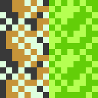

## Walkable/Green_Grass
- **Notes:** Plain green grass tile in Cerulean City. Fully walkable, not an obstacle or tall grass.

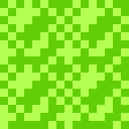

## Warp/Ladder_Up
- **Notes:** Ladder leading up to the previous floor.

## Warp/Stairs_Up_Right
- **Notes:** Looks like stairs leading up, facing right. Has yellow/brown vertical bars of increasing height from right to left. Found in Pokemon Tower 2F.

## Object/Grave_Marker
- **Notes:** Pink/red rectangular base with a white center. Found in Pokemon Tower. Likely a solid obstacle.

## Sprite/Green_Monster
- **Notes:** A green NPC sprite that looks like a small monster or Pokemon. Found in Pokemon Tower.

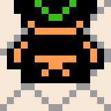

## Obstacle/Wall_Horizontal_YellowBrown
- **Notes:** A horizontal wall with a yellow top and brown bottom. Acts as a room divider.

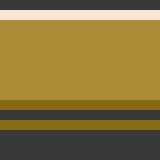

## Obstacle/Grave_Marker_Grey
- **Notes:** Grey rectangular object with a black top line. Appears to be the back of a grave marker. Resembles an NPC from a distance. Solid obstacle.

## Obstacle/Building_Edge_Right
- **Notes:** Right edge of a building with brown bricks. Likely solid.

## Walkable/Yellow_Path
- **Notes:** Yellow brick path found in Celadon City.

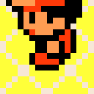

## Obstacle/Potted_Plant
- **Notes:** A green potted plant, likely a solid obstacle.

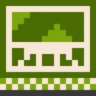

## Mechanic/Spin_Tile_Green
- **Notes:** A green spin tile, likely forces movement in a specific direction.

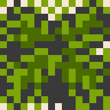

## Obstacle/Wall_Dark_Grey
- **Notes:** A dark grey vertical wall or room divider.

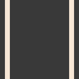

## Sprite/Rocket_Grunt
- **Notes:** Team rocket grunt. Hostile trainer.

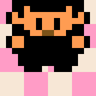

## Obstacle/Chair_Down
- **Notes:** A stool or chair facing downwards. Solid obstacle.

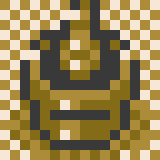

## Mechanic/Spin_Tile_Left
- **Notes:** Red spin tile with left-pointing arrows. Forces player left.

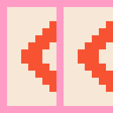

## Mechanic/Spin_Stop_Tile
- **Notes:** Tile with 4 grey squares. Stops player movement during a spin maze.

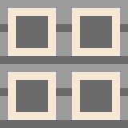

## Mechanic/Spin_Tile_Up
- **Notes:** Red spin tile with an up arrow. Forces player upwards.

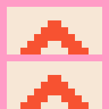

## Mechanic/Spin_Tile_Down_Red
- **Notes:** Red spin tile with downward pointing arrows. Forces player downwards.

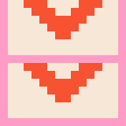

## Obstacle/Green_Border_Box
- **Notes:** White box with a green border. Likely a solid obstacle.

## Mechanic/Spin_Tile_Right
- **Notes:** Red spin tile with right-pointing arrows. Forces player right.

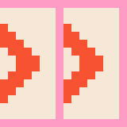

## Warp/Stairs_Down_Right
- **Notes:** Stairs leading downwards. Has yellow/brown vertical bars of increasing height from left to right. Found in Rocket Hideout B2F.

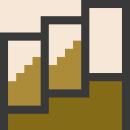

## Walkable/Hideout_Floor_Checkered
- **Notes:** Pink and red checkered floor tile. It is a standard walkable floor tile, NOT a spin tile.

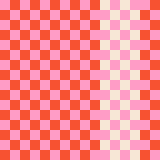

## Readable/Elevator_Panel
- **Notes:** Wall panel in the elevator with floor indicator lights and buttons.

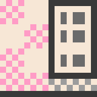

## Obstacle/Potted_Plant_Beige
- **Notes:** Beige potted plant with green leaves. Acts as a solid obstacle.

## Walkable/Door_Yellow_Grid
- **Notes:** Walkable yellow grid tile. Acts as an open gate or floor grating, allowing passage. Found on B1F.

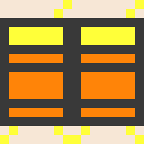

## Sprite/Giovanni
- **Notes:** The boss of Team Rocket.

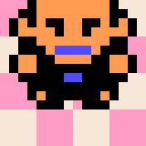

## Obstacle/Desk_Brown
- **Notes:** A brown desk tile. Likely solid.

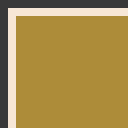

